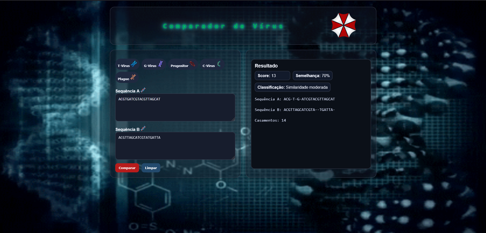

# G3_Programacao_Dinamica_PA-26.1

**Conteúdo da Disciplina**: Programação Dinâmica

## Sobre
O **Comparador de Vírus** é uma aplicação interativa que implementa um algoritmo de alinhamento de sequências de DNA para comparar vírus fictícios da Corporação Umbrella (do universo de Resident Evil). 

O projeto utiliza o algoritmo de alinhamento de sequência **Needleman-Wunsch**, um clássico da bioinformática que aplica programação dinâmica para encontrar o alinhamento ótimo global entre duas sequências de DNA, permitindo medir a similaridade genética entre diferentes cepas virais.

## Screenshot



## Site

Acesse ele [aqui](https://projeto-de-algoritmos-2026.github.io/G3_Programacao_Dinamica_PA-26.1/).

## Vídeo
Assista o vídeo de apresentação [aqui](Link).

## Algoritmo
O **Needleman-Wunsch** é um algoritmo de alinhamento global que utiliza programação dinâmica para encontrar o melhor alinhamento entre duas sequências.

### Como funciona:
1. **Matriz de Programação Dinâmica**: Cria uma matriz (m+1) × (n+1) onde m e n são os comprimentos das sequências
2. **Inicialização**: Preenche a primeira linha e coluna com penalidades de gap (-2)
3. **Preenchimento**: Para cada célula, calcula o máximo entre:
   - Diagonal: score anterior + match (2) ou mismatch (-1)
   - Acima: score anterior + gap (-2)
   - Esquerda: score anterior + gap (-2)
4. **Traceback**: Reconstrói o alinhamento começando do final da matriz

### Parâmetros de Scoring:
- **Match** (acerto): +2 pontos
- **Mismatch** (erro): -1 ponto
- **Gap** (lacuna): -2 pontos

### Complexidade:
```text
Tempo: O(m × n)    onde m e n são os comprimentos das sequências
Espaço: O(m × n)   para armazenar a matriz de DP
```

## Funcionalidades
* **Comparação de sequências de DNA** entre dois vírus
* **Biblioteca de vírus pré-configurados**: T-Virus, G-Virus, Progenitor, C-Virus e Plague
* **Entrada manual** de sequências de DNA personalizadas
* **Visualização de alinhamento** lado a lado
* **Cálculo de similaridade** em percentual
* **Score de alinhamento** baseado na matriz DP
* **Interface temática** com elementos visuais da Umbrella Corporation

## Instalação
**Linguagem**: `JavaScript`<br>
**Framework**: `Nenhum (HTML5 puro)`<br>
**Dependências**: Nenhuma

### Requisitos:
- Navegador web moderno com suporte a HTML5
- Suporte a áudio (MP3)

### Como executar:
1. Abra o arquivo `src/index.html` diretamente em um navegador
2. Ou sirva através de um servidor web local:
   ```bash
   python -m http.server 8000
   ```
   Depois acesse `http://localhost:8000/src/`

## Uso
1. **Selecione vírus pré-configurados** usando os botões de amostra (T-Virus, G-Virus, etc.)
2. **Ou digite sequências de DNA manualmente** nos campos de entrada (use apenas as letras A, C, G, T)
3. Clique em **"Comparar"** para executar o algoritmo de Needleman-Wunsch
4. Visualize os resultados:
   - **Alinhamento**: As duas sequências alinhadas
   - **Score**: Pontuação total do alinhamento
   - **Similaridade**: Percentual de bases correspondentes
   - **Matches**: Número absoluto de coincidências

## Estrutura
```text
.
├── README.md
├── src/
│   ├── index.html          # Página principal
│   ├── script.js           # Algoritmo e 
│   ├── styles.css          # Estilos e tema
│   └── assets/             # Imagens, sons e recursos visuais
│       ├── umbrella.png
│       ├── tvirus.png
│       ├── gvirus.png
│       ├── projenitorv.png
│       ├── cvirus.png
│       ├── plaga.png
│       ├── dna.png
│       └── ambientbg.mp3
```
